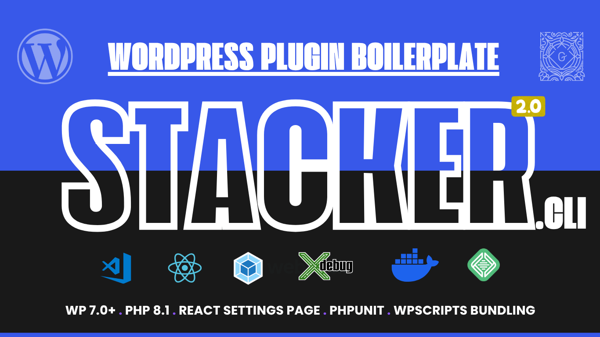

# STACKER-plugin-CLI : WordPress Plugin Developer Toolkit



A zero-configuration CLI that scaffolds a modern WordPress plugin in seconds. Answer a few questions and Stacker generates a fully wired-up plugin built on PHP 8.1+, WordPress 7.0, [`@wordpress/scripts`](https://developer.wordpress.org/block-editor/reference-guides/packages/packages-scripts/), and a complete development, testing, and packaging workflow.

<table width="100%">
    <tbody>
    <tr>
        <td style="margin: 0; padding: 0;">
            A FOSS (Free &amp; Open Source Software) WordPress project. Developed &amp; Maintained by <a href="https://github.com/provineet">@provineet</a>.
        </td>
        <td align="center">
            <strong>Vineet Verma</strong>
        </td>
    </tr>
</tbody></table>


<br>

## ✨ What the generated plugin gives you

Stacker scaffolds a plugin from the [Stacker WordPress Plugin Boilerplate](https://github.com/provineet/stacker-plugin-boilerplate), which ships with:

- 🧩 **Namespaced, autoloaded PHP.** A small custom autoloader maps your `PREFIX\…` classes to files — no manual `require` list. A singleton `Loader` bootstraps everything and keeps admin-only code behind `is_admin()`.
- 🧱 **Four example blocks** under `src/blocks/`: two static blocks, a dynamic block rendered by `render.php` on each request, and an interactive block built on the WordPress Interactivity API.
- ⚛️ **React settings page.** A data-driven settings screen that reads and writes a single option through core's `/wp/v2/settings` REST endpoint, with a reusable field library (`text`, `select`, `toggle`, `media`, and more). No custom REST routes to maintain.
- 🔌 **Service layer.** A `DB` wrapper that centralises `$wpdb` access and prepared statements, plus an `API` scaffold for registering your own `stacker/v1` REST routes.
- 🛠️ **Asset & block tooling** via `@wordpress/scripts`: separate build/watch for blocks and assets, live reload through Browser-Sync, and ESLint, Stylelint, and Prettier already configured.
- ✅ **Pre-commit checks.** Husky and lint-staged run the linters on staged files before each commit.
- 🧹 **PHP quality tooling.** WordPress Coding Standards via PHPCS/PHPCBF, PHP compatibility checks, and generated WordPress stubs for editor autocomplete.
- 🧪 **PHPUnit tests** against a real database using the official WordPress test framework (`wp-phpunit` + Yoast polyfills).
- 🐳 **Dockerised dev stack.** A throwaway WordPress environment with your plugin mounted, Xdebug wired up, a mail catcher, and a VS Code Dev Container.
- 📦 **Packaging scripts.** `npm run dist` builds a production zip with dev dependencies stripped; `uninstall.php` handles cleanup on removal.

> The CLI lets you opt in or out of Gutenberg blocks, PHPUnit, and your development environment (Docker Desktop or LocalWP) — files you don't need are stripped from the generated plugin automatically.

## 🚀 How the CLI works

Stacker asks a set of questions, then downloads the boilerplate, fills in your details, and writes a ready-to-develop plugin into a new folder named after your plugin.

### ➡️ Quick start

In your terminal, `cd` to your plugin development folder (usually `wp-content/plugins`) and run:

```bash
npx stacker-plugin-cli
```

Answer the prompts (see below) and a fresh plugin boilerplate is generated inside a new subfolder of your current directory.


Once generation finishes, `cd` into your new plugin folder and install dependencies:

```bash
cd your-plugin-folder
npm install
composer install
```

Then start the development build to watch your JS, image, and SCSS changes (with hot-reloading):

```bash
npm run start
```

## ❓ Questions you'll be asked

| Prompt | What it sets |
| --- | --- |
| **Plugin name** | Plugin display name; also derives the folder name, namespace, and main file name |
| **Plugin version** | Initial version of your plugin |
| **Text domain** | i18n text domain (also used to derive the block namespace and category) |
| **Prefix** | Prefix for your plugin's global functions and constants |
| **Development environment** | `Docker Desktop` or `LocalWP` — keeps only the relevant config files |
| **Gutenberg blocks?** | `Yes` keeps `src/blocks` and the block build scripts; `No` strips them |
| **Configure PHPUnit?** | `Yes` keeps the test suite and `phpunit.xml.dist`; `No` removes them |
| **Plugin URL** | The plugin's homepage URL |
| **Description** | Plugin description |
| **Author name / URL / email** | Author metadata (also derives the Composer vendor) |
| **`@package` name** | The `@package` directive used in plugin file headers |
| **License** | Plugin license (default `GPL-2.0-or-later`) |
| **Local development URL to proxy** | Your local WordPress URL, used to set up Browser-Sync hot-reloading |

## 🚩 CLI flags

| Flag | Alias | Description |
| --- | --- | --- |
| `--output` | `-o` | Output path for your generated plugin files (defaults to the current directory) |
| `--repo` | | Template source repo as a [degit](https://github.com/Rich-Harris/degit) spec — overrides the configured source |
| `--ref` | | Branch or tag of the template repo to use |
| `--refresh` | | Force a re-download of the template, ignoring the local cache |
| `--clear` | `-c` | Clear the console (on by default) |
| `--no-clear` | | Don't clear the console |
| `--debug` | `-d` | Print debug info |
| `--version` | `-v` | Print the CLI version |
| `help` | | Print help info |

> The boilerplate template is pulled from a **public git repo** with `degit`, templatized on the fly, and cached locally for offline reuse. Use `--repo` / `--ref` to point at your own fork, and `--refresh` to bypass the cache.

## 📂 Generated plugin structure

A plugin generated with Docker, blocks, and PHPUnit enabled looks roughly like this:

```bash
./your-plugin
├── Dockerfile                  '(builds the WordPress dev image)'
├── docker-compose.yaml         '(throwaway WordPress dev stack + mail catcher)'
├── docker-configs/             '(php.ini & xdebug.ini for the dev stack)'
├── composer.json               '(PHP dependencies, PHPCS/PHPCBF, PHPUnit scripts)'
├── package.json                '(npm scripts: build/watch, lint, dist)'
├── phpunit.xml.dist            '(PHPUnit configuration)'
├── uninstall.php               '(cleanup on plugin removal)'
├── your-plugin.php             '(main plugin file & bootstrap)'
├── inc/                        '(namespaced, autoloaded PHP)'
│   ├── class-autoloader.php
│   ├── class-loader.php        '(singleton bootstrap)'
│   ├── admin/                  '(admin-only classes & hooks)'
│   ├── public/                 '(frontend functionality)'
│   ├── services/               '(DB wrapper & REST API scaffold)'
│   └── helpers/                '(autoloaded *-functions.php helpers)'
├── src/                        '(source assets)'
│   ├── assets/                 '(shared JS/SCSS + React settings page)'
│   └── blocks/                 '(Gutenberg blocks: static, dynamic, interactive)'
└── tests/                      '(PHPUnit tests against a real WP test DB)'
```

## ⚡️ NPM commands in the generated plugin

- `npm run start` — Watch JS, image, and SCSS changes in `src/` and trigger hot-reloading.
- `npm run build` — Build your blocks and other assets.
- `npm run dist` — Create a production-ready distributable zip with dev dependencies stripped.
- `npm run format` — Format the plugin's SCSS and JS files.

## ⚡️ Composer commands in the generated plugin

- `composer phpcs` — Run PHP Code Sniffer with WordPress Coding Standards on your plugin files.
- `composer phpcbf` — Auto-fix coding standard errors with PHP Code Beautifier.
- `composer test` — Run the PHPUnit tests in the `tests/` directory (when PHPUnit is enabled).

> See the [boilerplate documentation](https://github.com/provineet/stacker-plugin-boilerplate) for the full development guide, testing setup, settings page, and field library.

<br>
<blockquote>
Follow me on twitter. I tweet about Dev Tools, latest tech and tuts for the community. 🐦 <a href="https://twitter.com/mrvineetverma">@MrVineetVerma</a>
</blockquote>
<br>

<blockquote>
If you have any query or suggestions, please feel free to get in touch with me on twitter or just fork the github repo and start contributing.
</blockquote>
